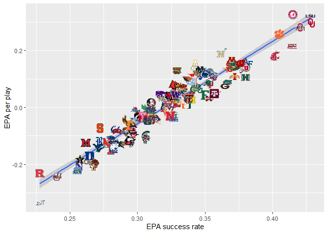
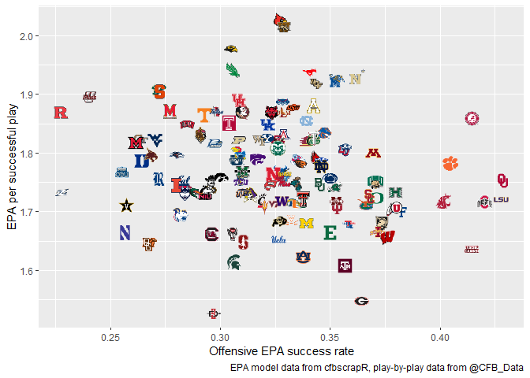
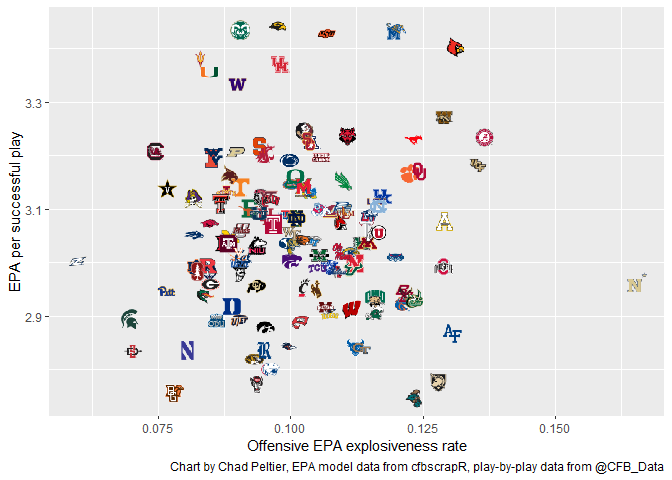
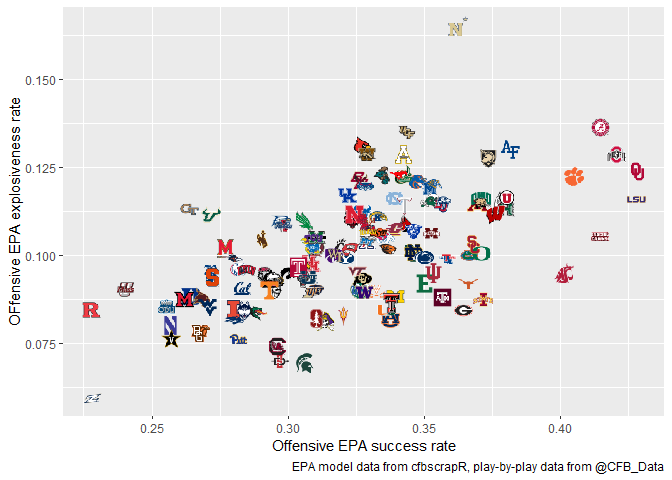

One of the early advances in college football analysis was the distinction between efficiency and explosiveness, where efficiency refers to steady progress towards a first down and/or down the field, while explosiveness refers to the creation of large "chunk plays". Explosive plays might traditionally be defined as plays over a certain distance -- i.e. 15 or 20 yards. 

You can read much more about efficiency and explosiveness through Bill Connelly's [explanation about his SP+ analytics system](https://www.sbnation.com/college-football/2017/10/13/16457830/college-football-advanced-stats-analytics-rankings) and his [deep dive into how explosive plays in football are like three-pointers in basketball](https://www.footballstudyhall.com/2017/8/22/16075050/college-football-big-plays-efficiency-five-factors). 

Expected points added (EPA) is an extremely powerful way to analyze efficiency and explosiveness. First, because it quanitifies *how* good a play was in addition to just *whether* a play was good, EPA differentiates between a five-yard gain on third-and-four from the 50-yard line and a 25-yard gain from midfield. Both plays would be counted as "successful" using the binary "success rate" metric, but EPA would say that the expected points differential between those two plays is approximately 1.6 points. 

Essentially, that specific situation -- third-and-four from midfield -- has a expected points value of approximately 1.2 points before the start of the play. If the play goes for a five-yard gain (continuining the drive but still uncertain whether the drive will end in points), the expected points added by that five yard gain is 1.7 points. The new expected points value of your new drive state (first-and-ten from your opponent's 45 yard line) is roughly 2.8 points. 

However, if you were to complete a long pass for 25 yards in that same situation -- as Florida's Kyle Trask did to Tyrie Cleveland against Florida State -- the EPA from that play is about 3.3 points. Therefore, the higher the EPA for a play, the more explosive the play was relative to expectations based on that play's down, distance to go, and field position. 

Second, because it is calculated for each individual play, EPA allows us to do any number of more granular analyses. For example, we can calculate average EPA per play (average EPA) or just look at the percentage of plays with a positive EPA (which is essentially a more advanced version of "success rate"). Or we can look at average EPA for individual players, or teams in specific situations (like on third down, or in the red zone, or in "open play" between the 20 yard lines). 

In contrast, other approaches to calculating explosiveness in football often either lack the ability to analyze the magnitude of an explosive play (focusing instead on the *rate* of explosive plays) or aren't based on modeled, or expected, performance. As mentioned above, one common approach is to just look at the percentage of plays that gain a certain number of yards -- sometimes 10, 15, or 20.

One way to figure out a yard line cut off point would be to look at the top top quartile or 90% of all yards gained per play. For example, the following code calculates the yards_gained variable for the top quartile (75%) and at 90%:  


```r
library(tidyverse)
```

```
## -- Attaching packages ------------------------------------------------------------------- tidyverse 1.3.0 --
```

```
## v ggplot2 3.2.1     v purrr   0.3.3
## v tibble  2.1.3     v dplyr   0.8.3
## v tidyr   1.0.0     v stringr 1.4.0
## v readr   1.3.1     v forcats 0.4.0
```

```
## -- Conflicts ---------------------------------------------------------------------- tidyverse_conflicts() --
## x dplyr::filter() masks stats::filter()
## x dplyr::lag()    masks stats::lag()
```

```r
library(cfbscrapR)
```

```
## Warning: replacing previous import 'mgcv::multinom' by 'nnet::multinom' when
## loading 'cfbscrapR'
```

```r
library(ggimage)

pbp_2019 <- read_csv("pbp_15_19_rp.csv") 
```

```
## Warning: Missing column names filled in: 'X1' [1]
```

```
## Parsed with column specification:
## cols(
##   .default = col_double(),
##   offense = col_character(),
##   defense = col_character(),
##   home = col_character(),
##   away = col_character(),
##   play_type = col_character(),
##   play_text = col_character(),
##   scoring = col_logical(),
##   Under_two = col_logical(),
##   Goal_To_Go = col_logical(),
##   drive_result = col_character(),
##   start_time.hours = col_logical(),
##   end_time.hours = col_logical(),
##   rush_pass = col_character(),
##   rush_player = col_character(),
##   pass_player = col_character(),
##   receiver_player = col_character()
## )
```

```
## See spec(...) for full column specifications.
```

```
## Warning: 30 parsing failures.
##    row              col           expected actual               file
## 473345 start_time.hours 1/0/T/F/TRUE/FALSE     2  'pbp_15_19_rp.csv'
## 473345 end_time.hours   1/0/T/F/TRUE/FALSE     10 'pbp_15_19_rp.csv'
## 473357 start_time.hours 1/0/T/F/TRUE/FALSE     2  'pbp_15_19_rp.csv'
## 473357 end_time.hours   1/0/T/F/TRUE/FALSE     10 'pbp_15_19_rp.csv'
## 473358 start_time.hours 1/0/T/F/TRUE/FALSE     2  'pbp_15_19_rp.csv'
## ...... ................ .................. ...... ..................
## See problems(...) for more details.
```

```r
pbp_2019 <- pbp_2019 %>%
    filter(season == 2019)

yards_gained <- pbp_2019 %>%
    mutate(rush_pass = if_else(rush == 1, "rush", if_else(pass == 1, "pass", "NA"))) %>%
    drop_na(rush_pass) %>%
    select(yards_gained, rush_pass)

yards_gained %>%
    group_by(rush_pass) %>%
    summarize(quantiles = list(enframe(quantile(yards_gained, probs = c(.75, .9))))) %>%
    unnest
```

```
## Warning: `cols` is now required.
## Please use `cols = c(quantiles)`
```

```
## # A tibble: 4 x 3
##   rush_pass name  value
##   <chr>     <chr> <dbl>
## 1 pass      75%      11
## 2 pass      90%      20
## 3 rush      75%       7
## 4 rush      90%      12
```

As shown above, the 90th percentile of rushes went for >=12 yards, while the 90th percentile of passes went for >=20 yards. As a result, it would be simple to add a variable for "explosive_play" that uses that (somewhat artbitrary!) definition of the 90th percentile of yards_gained: 


```r
exp_plays <- pbp_2019 %>%
    mutate(explosive_play = if_else(rush==1 & yards_gained >=12, 1,
                                    if_else(pass==1 & yards_gained >=20, 1, 0)))
```

That is interesting in and of itself, but we can go deeper using EPA. 

This project will take a closer look at the variation between efficiency and explosiveness for FBS teams during the 2019 college football regular season. It will use the basic EPA summary data created in another one of my projects, "Data Cleaning and Exploratory Analysis of the 2019 College Football Season Using Expected Points Added (EPA) Data." We'll use the tidyverse as well as the cfbscrapR package from that project. 

## Team efficiency vs. explosiveness 
First let's just plot all teams by their efficiency (defined here as EPA success rate, or the percentage of positive EPA rush/pass plays) and their average EPA on the y-axis.

This chart also adds in a linear regression line with a 95% confidence interval. This allows us to see teams that have a significantly higher or lower average EPA than we would expect given their EPA success rate.


```r
season_stats_offense <- read_csv("season_stats_off.csv")
```

```
## Warning: Missing column names filled in: 'X1' [1]
```

```
## Parsed with column specification:
## cols(
##   .default = col_double(),
##   team = col_character(),
##   logo = col_character()
## )
```

```
## See spec(...) for full column specifications.
```

```r
ggplot(data=season_stats_offense, aes(x = epa_sr, y = avg_epa)) +
    geom_smooth(method = lm) + 
    geom_image(aes(image = logo), size = .03, by = "width", asp = 1.8) +
    xlab("EPA success rate") +
    ylab("EPA per play")
```

<!-- -->

```r
    ggsave("epa_off_sr_avg_epa.png", height = 9/1.2, width = 16/1.2)
```

As you can see above, Rutgers and UMass are incredibly inefficient, while the four playoff teams plus Alabama and Lousiana are *extremely* efficient. Alabama is more explosive than you might expect given their efficiency, whie teams like Georgia, Texas A&M, and Florida are less efficient than we might expect. 

We can also look at the relationship between those two variables through a linear regression rather than just seeing the visualization.


```r
model <- lm(avg_epa ~ epa_sr, data = season_stats_offense)

summary(model)
```

```
## 
## Call:
## lm(formula = avg_epa ~ epa_sr, data = season_stats_offense)
## 
## Residuals:
##       Min        1Q    Median        3Q       Max 
## -0.069394 -0.022293 -0.002281  0.023068  0.102413 
## 
## Coefficients:
##             Estimate Std. Error t value Pr(>|t|)    
## (Intercept) -0.92781    0.02563  -36.20   <2e-16 ***
## epa_sr       2.90093    0.07865   36.88   <2e-16 ***
## ---
## Signif. codes:  0 '***' 0.001 '**' 0.01 '*' 0.05 '.' 0.1 ' ' 1
## 
## Residual standard error: 0.03572 on 127 degrees of freedom
## Multiple R-squared:  0.9146,	Adjusted R-squared:  0.9139 
## F-statistic:  1360 on 1 and 127 DF,  p-value: < 2.2e-16
```

This shouldn't be much surprise based on the chart above, but EPA success rate is extremely predictive of average EPA per play. Given that the p-value for epa_sr is < 0.001, it is extremely unlikely that the two variables are unrelated. Additionally, the adjusted R-squared suggests that epa_sr explains 91.39% of the variation in avg_epa! 

### Isolating average EPA on only successful plays
Another interesting thing we can do is to look at efficiency vs. average EPA on only successful plays. This is another way to look at efficiency vs. explosivness, as looking at the average EPA on just successful plays (EPA > 0) narrows the focus on explosiveness by removing bad plays before we calculate the average EPA per play. 

Another way of thinking about it might be as "isolated explosiveness", because we're isolating the *magnitude* of positive plays separate from the *rate* of positive plays. 


```r
ggplot(data = season_stats_offense, aes(x = epa_sr, y = avg_epa_success)) +
    geom_image(aes(image = logo), size = .03, by = "width", asp = 1.8) +
    xlab("Offensive EPA success rate") +
    ylab("EPA per successful play") +
    labs(caption = "EPA model data from cfbscrapR, play-by-play data from @CFB_Data")+
    ggsave("epa_success_avg_epa.png", height = 9/1.2, width = 16/1.2)
```

<!-- -->

This view shows the variation between teams' explosiveness more clearly than the first chart. The order of teams on the x-axis is the same as in the first chart, but this chart shows wider variation between teams' explosiveness as measured by EPA per successful play. 

This chart (and the next) help us see which teams only get the necessary yardage vs. which teams get way more than the necessary yardage, given their down, distance, and field position. For example, Georgia is 20th in the country in EPA success rate, but they're *second-to-last* in the country in EPA per successful play! 

Further, just looking at playoff teams, Ohio State and LSU are two of the three most efficient teams in the country, but Oklahoma is more explosive. Clemson is even more explosive -- although they are also less efficient than the other three. 

## Explosiveness rate using EPA
Just like we did above the yards_gained variable, we can also calculate the 90th percentile EPAs for rushes and passes in order to create a new variable showing explosiveness rate. This will specify an EPA threshold for a play to be considered explosive, then see how often on average a team creates explosive plays. 


```r
explosive_EPA <- pbp_2019 %>%
    mutate(rush_pass = if_else(rush == 1, "rush", 
                               if_else(pass == 1, "pass", "NA"))) %>%
    filter(rush_pass == "rush" | rush_pass == "pass") %>%
    select(EPA, rush_pass)


explosive_EPA %>%
    group_by(rush_pass) %>%
    summarize(quantiles = list(enframe(quantile(EPA, probs = c(.75, .9))))) %>%
    unnest
```

```
## Warning: `cols` is now required.
## Please use `cols = c(quantiles)`
```

```
## # A tibble: 4 x 3
##   rush_pass name  value
##   <chr>     <chr> <dbl>
## 1 pass      75%   1.09 
## 2 pass      90%   2.45 
## 3 rush      75%   0.716
## 4 rush      90%   1.79
```

So we can see that the 90th percentile EPA for rushes is 1.79 and the 90th percentile for passes is 2.45. We can then use that information to create a new binary variable for whether a play was explosive or not based based on EPA: 


```r
pbp_2019 %>%
    mutate(epa_explosive = if_else(rush == 1 & EPA >= 1.7917221, 1, 
                                 if_else(pass == 1 & EPA >= 2.4486338, 1, 0)))
```

```
## # A tibble: 115,834 x 78
##        X1 game_id drive_id new_id id_play.x offense defense home  away  period
##     <dbl>   <dbl>    <dbl>  <dbl>     <dbl> <chr>   <chr>   <chr> <chr>  <dbl>
##  1 484768  4.01e8   4.01e9 1.02e8   4.01e17 Alabama Duke    Alab~ Duke       1
##  2 484769  4.01e8   4.01e9 1.02e8   4.01e17 Alabama Duke    Alab~ Duke       1
##  3 484770  4.01e8   4.01e9 1.02e8   4.01e17 Alabama Duke    Alab~ Duke       1
##  4 484771  4.01e8   4.01e9 1.02e8   4.01e17 Duke    Alabama Alab~ Duke       1
##  5 484772  4.01e8   4.01e9 1.02e8   4.01e17 Duke    Alabama Alab~ Duke       1
##  6 484773  4.01e8   4.01e9 1.02e8   4.01e17 Duke    Alabama Alab~ Duke       1
##  7 484774  4.01e8   4.01e9 1.02e8   4.01e17 Alabama Duke    Alab~ Duke       1
##  8 484775  4.01e8   4.01e9 1.02e8   4.01e17 Alabama Duke    Alab~ Duke       1
##  9 484776  4.01e8   4.01e9 1.02e8   4.01e17 Duke    Alabama Alab~ Duke       1
## 10 484777  4.01e8   4.01e9 1.02e8   4.01e17 Duke    Alabama Alab~ Duke       1
## # ... with 115,824 more rows, and 68 more variables: half <dbl>,
## #   clock.minutes <dbl>, clock.seconds <dbl>, offense_score <dbl>,
## #   defense_score <dbl>, play_type <chr>, play_text <chr>, scoring <lgl>,
## #   TimeSecsRem <dbl>, Under_two <lgl>, down <dbl>, Goal_To_Go <lgl>,
## #   distance <dbl>, adjusted_yardline <dbl>, yards_gained <dbl>,
## #   TimeSecsRem_end <dbl>, down_end <dbl>, distance_end <dbl>,
## #   adj_yd_line_end <dbl>, ppa <dbl>, start_yardline <dbl>, yards <dbl>,
## #   drive_result <chr>, pts_drive <dbl>, turnover <dbl>, ep_before <dbl>,
## #   ep_after <dbl>, EPA <dbl>, score_diff <dbl>, home_EPA <dbl>,
## #   away_EPA <dbl>, ExpScoreDiff <dbl>, ExpScoreDiff_Time_Ratio <dbl>,
## #   rz_play <dbl>, scoring_opp <dbl>, pass <dbl>, rush <dbl>,
## #   stuffed_run <dbl>, success <dbl>, epa_success <dbl>, wp <dbl>,
## #   def_wp <dbl>, home_wp <dbl>, away_wp <dbl>, change_of_poss <dbl>,
## #   end_of_half <dbl>, lead_wp <dbl>, wpa_base <dbl>, wpa_change <dbl>,
## #   wpa <dbl>, home_wp_post <dbl>, away_wp_post <dbl>, adj_TimeSecsRem <dbl>,
## #   season <dbl>, start_time.hours <lgl>, end_time.hours <lgl>, so_play <dbl>,
## #   rush_pass <chr>, opp_rate_run <dbl>, epa_explosive <dbl>,
## #   short_rush_attempt <dbl>, short_rush_success <dbl>, std.down <dbl>,
## #   pass.down <dbl>, year <dbl>, rush_player <chr>, pass_player <chr>,
## #   receiver_player <chr>
```

Here's a chart that shows explosiveness rate on the x-axis and average EPA for only explosive plays on the y-axis. This chart shows how often a team is explosive, and then when they're explosive, just *how* explosive they actually are. 

It's similar to the second chart above, but instead of looking at average EPA on all positive plays, it looks at average EPA on just explosive plays, allowing us to get an even better handle on the magnitude of a team's explosiveness when they are explosive. 


```r
ggplot(data = season_stats_offense, aes(x = epa_er, y = avg_epa_explosive)) +
    geom_image(aes(image = logo), size = .03, by = "width", asp = 1.8) +
    xlab("Offensive EPA explosiveness rate") +
    ylab("EPA per successful play") +
    labs(caption = "Chart by Chad Peltier, EPA model data from cfbscrapR, play-by-play data from @CFB_Data")+
    ggsave("epa_explosive_avg_epa.png", height = 9/1.2, width = 16/1.2)
```

<!-- -->

## Success rate and explosiveness rate
Finally, we can take a look at two rates -- success rate and explosiveness rate, both of which were made using the EPA definitions above. 


```r
ggplot(data = season_stats_offense, aes(x = epa_sr, y = epa_er)) +
    geom_image(aes(image = logo), size = .03, by = "width", asp = 1.8) +
    xlab("Offensive EPA success rate") +
    ylab("OFfensive EPA explosiveness rate") +
    labs(caption = "EPA model data from cfbscrapR, play-by-play data from @CFB_Data")+
    ggsave("epa_success_explosiveness.png", height = 9/1.2, width = 16/1.2)
```

<!-- -->


